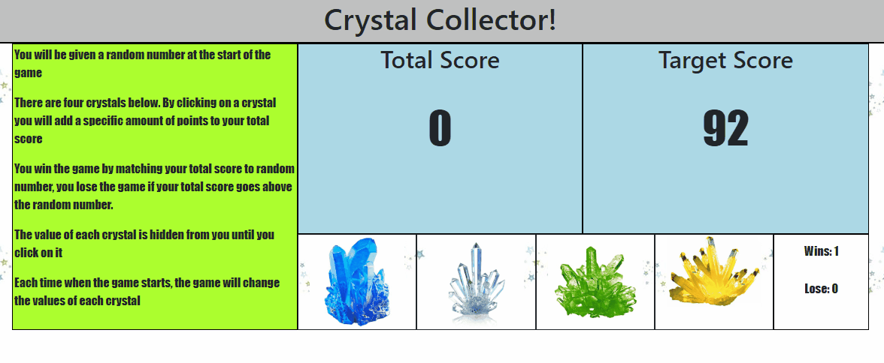

# Crystal Collection Game
   ## **Reach the target score by collecting crystals!**


## Demo
<br>
[Click here to start playing](https://tintdang.github.io/crystal-collector/)

## Getting Started
```
git clone git@github.com:tintdang/crystal-collector.git
open index.html in your favorite browser
```

## Instructions
   * There will be four crystals displayed as buttons on the page.

   * The player will be shown a random number at the start of the game.

   * When the player clicks on a crystal, it will add a specific amount of points to the player's total score. 

     * Your game will hide this amount until the player clicks a crystal.
     * When they do click one, update the player's score counter.

   * The player wins if their total score matches the random number from the beginning of the game.

   * The player loses if their score goes above the random number.

   * The game restarts whenever the player wins or loses.

     * When the game begins again, the player should see a new random number. Also, all the crystals will have four new hidden values. Of course, the user's score (and score counter) will reset to zero.


 ## Built With
- HTML & CSS
- Javascript
- [Bootstrap](https://getbootstrap.com/)
- [jQuery](https://jquery.com/download/)

## Author

* **Tin Dang**  - [tintdang](https://github.com/tintdang)

## Acknowledgments

* Thanks to The Coding Boot Camp at UT Austin

